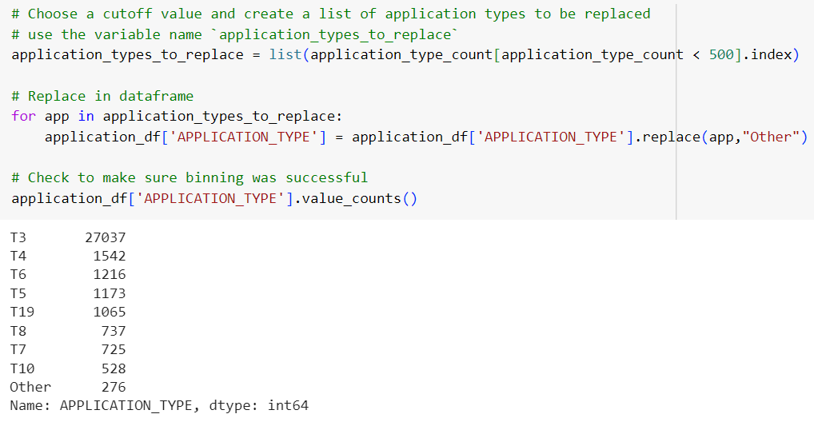
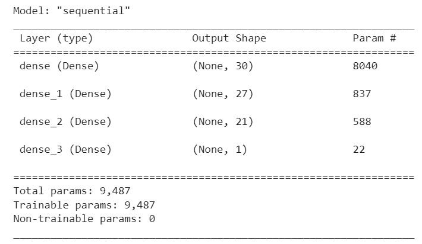

# Alphabet Soup Charity
# Predicting Successful Candidates for Funding using Neural Networks

## Overview:

This report is prepared for Alphabet Soup which is a nonprofit foundation. The report is based on an analysis performed using Machine Learning and Neural Network. The purpose is to help prepare a tool for the foundation which can help it select the applicants for funding with the best chance of success in their ventures. 

## Data Source:

The analysis is based on the CSV provided by the business team at Alphabet Soup. The CSV contains more than 34,000 organizations that have received funding from the foundation over the years. Within this dataset are a number of columns that capture metadata about each organization, such as:

•	EIN and NAME – Identification columns       
•	APPLICATION_TYPE – Alphabet Soup application type      
•	AFFILIATION – Affiliated sector of industry            
•	CLASSIFICATION – Government organization classification              
•	USE_CASE – Use case for funding                  
•	ORGANIZATION – Organization type                
•	STATUS – Active status                 
•	INCOME_AMT – Income classification              
•	SPECIAL_CONSIDERATIONS – Special considerations for application             
•	ASK_AMT – Funding amount requested              
•	IS_SUCCESSFUL – Was the money used effectively             

I have used the features in the provided dataset to create a binary classifier that can predict whether applicants will be successful if funded by the foundation.

## Neural Network Models:
There are two neural network models created to predict the successful candidates. The first model is created by applying some optimization methods but it did not achieve the 75% accuracy. A second optimized model was then created by adjusting the optimization methods to try and achieve 75% or greater accuracy. 

Following are the steps taken to create each of the models:

### ORIGINAL MODEL:

This neural network model was created by completing the following steps:

**Data Preprocessing:**                
The data was preprocessed by reviewing the available variables.        

•	*Target Variable*            
    The target variable in this model is:              
    o	IS_SUCCESSFUL

•	*Feature Variables*                    
    The feature variables used for the model include:                       
    o	APPLICATION_TYPE               
    o	AFFILIATION                      
    o	CLASSIFICATION                  
    o	USE_CASE                  
    o	ORGANIZATION                     
    o	STATUS               
    o	INCOME_AMT                  
    o	SPECIAL_CONSIDERATIONS                  
    o	ASK_AMT                

•	*Removed Variables*                 
    Following variables were removed from the input data as these are neither targets nor features:                           
    o	EIN                   
    o	NAME                         

•	Binning                          
    The data preprocessing also included creating bins for two specific variables by creating cutoff values for value counts of the underlying categories, and creating a bin called Other to store the categories with a value count of less than the cutoff value.

    o	APPLICATION_TYPE                       
    This variable was binned into 9 categories by creating a cutoff value of 500.

    o	CLASSIFICATION                       
    This variable was binned into 6 categories by creating a cutoff value of 1000.

**Compiling, Training, and Evaluating the Model:**
After preprocessing the data, the model was compiled, trained and evaluated by defining the following details:

•	*Neuron Layers*                      
    There were two hidden layers and an output layer created in this model.  The first hidden layer contained 80 neurons and the second layer had 30 neurons. 

•	*Activation Functions*                        
    Relu activation function was used for the hidden layers, whereas Sigmoid activation function was used for the output layer.

•	*Parameters*                        
    The model was trained based on a total of 5,981 parameters.

•	*Epochs*                        
    The model was then fitted and trained by using 100 epochs.

•	*Model Performance*                   
    This model was evaluated to have an accuracy score of 72.87% which is below the target performance of 75%.

### OPTIMIZED MODEL:

In order to improve the accuracy of the original model, following steps were taken:

1.	Dropping lesser columns/ variables
2.	Creating bins for an additional variable
3.	Decreasing the number of values for the Other bin for one of the variables
4.	Adding one more hidden layer
5.	Changing the number of neurons in each hidden layer

This optimized neural network model was created by completing the following steps:

**Data Preprocessing:**                      
The data was preprocessed by reviewing the available variables.

•	*Target Variable*                 
    The target variable in this model is:                
    o	IS_SUCCESSFUL

•	*Feature Variables*                  
    The feature variables used for the model include:                  
        o	NAME              
        o	APPLICATION_TYPE                  
        o	AFFILIATION                     
        o	CLASSIFICATION                   
        o	USE_CASE                     
        o	ORGANIZATION                     
        o	STATUS                   
        o	INCOME_AMT                   
        o	SPECIAL_CONSIDERATIONS                     
        o	ASK_AMT                      

•	*Removed Variables*                     
    Only one variable was removed (as compared to two in the original model) from the input data as it is neither target nor feature:                    
    o	EIN                     

•	*Binning*                        
The data preprocessing also included creating bins for three specific variables (as compared to two variables in the original data) by creating cutoff values for value counts of the underlying categories, and creating a bin called Other to store the categories with a value count of less than the cutoff value.                

    o	NAME                    
    This variable was binned into various categories by creating a cutoff value of 10. Please note that this was not binned in the original model.

    o	APPLICATION_TYPE                          
    This variable was binned into 9 categories by creating a cutoff value of 500 which is similar to the original model.

    o	CLASSIFICATION                       
    This variable was binned into 7 categories by creating a cutoff value of 500. The original model had 6 categories based on cutoff value of 1000.

**Compiling, Training, and Evaluating the Model:**                   
After preprocessing the data, the model was compiled, trained and evaluated by defining the following details:

•	*Neuron Layers*                       
    There were three hidden layers (as compared to two in the original model) and an output layer created in this model.  The first hidden layer contained 30 neurons, the second layer had 27 and the third layer had 21 neurons. 

•	*Activation Functions*                         
    Relu activation function was used for the hidden layers, whereas Sigmoid activation function was used for the output layer.

•	*Parameters*                      
    The model was trained based on a total of 9,487 parameters.

•	*Epochs*                    
    The model was then fitted and trained by using 100 epochs.
 

•	*Model Performance*                        
    This optimized model was evaluated to have an accuracy score of 77.87% which is above the target performance of 75% and 5% higher than the original model.

## Summary:

Based on the evaluation of the two models described in the sections above, my recommendation is to use the optimized model to help predict the successful candidates for charity funding at Alphabet Soup. The optimized model yielded an overall better accuracy score of 77.87% compared to the original model at 72.87% and it was also met the target accuracy of 75% or higher. This model uses one additional feature variable from the input dataset to predict the target variable. It also includes bins created for an additional variable as well as additional bins created for one of the variables compared to the original model. Adding the bins seemed to have improved the outcome of this model.

The optimized model also includes additional hidden layer by making it a total of three hidden layers. It does, however, has lesser number of neurons for the first two hidden layers. This implies that although the overall number of neurons were lesser in the optimized model, however, the increased number of layers ended up increasing the number of trained parameters which eventually affected the accuracy of this model in a positive manner.

The recommended model in this case is definitely the second optimized model as it was more accurately able to predict the successful candidates for charity funding based on the change in optimization methods.

